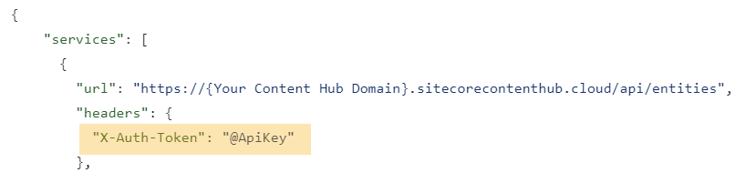
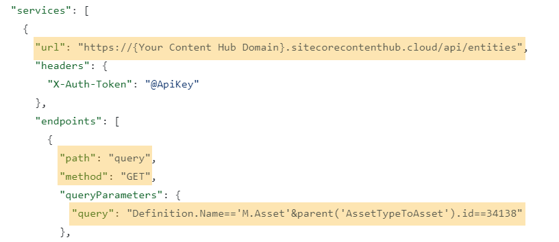
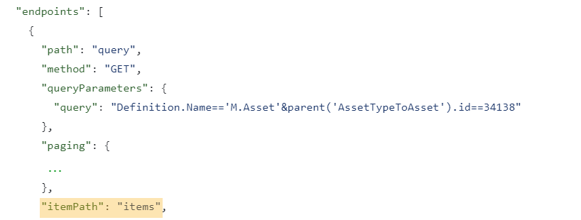
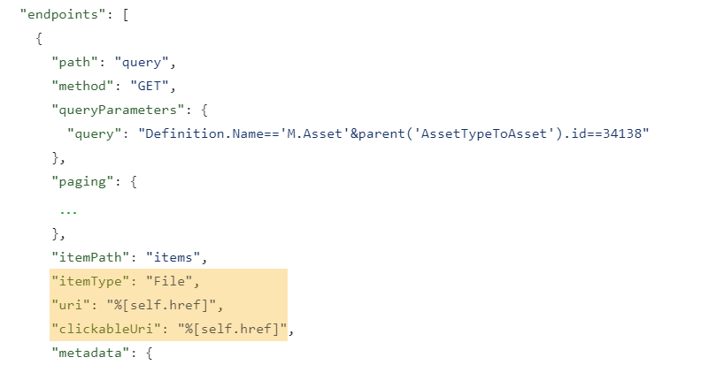
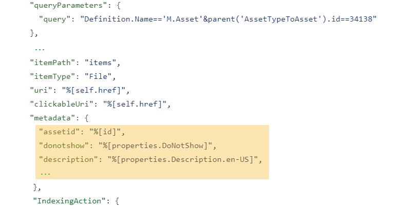
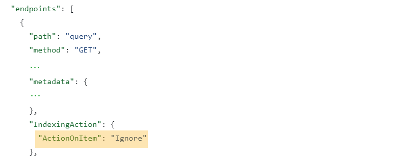
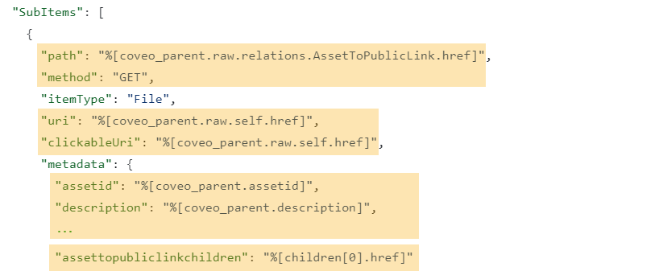
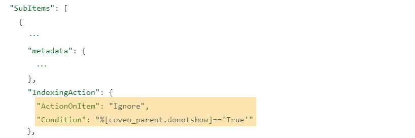

# Understanding the `SourceJSONConfig.json` file

The following are a few pointers to help you understand the example JSON configuration:

## Authenticating calls to the Content Hub API

All calls to the Sitecore Content Hub performed in the configuration [inherit](https://docs.coveo.com/en/3131/#inheritable-properties) the `X-Auth-Token` header property.
The `@ApiKey` syntax is used to retrieve the `API key` field value from the REST source user interface [Authentication section](https://docs.coveo.com/en/1896/#authentication-section).

## Setting the main HTTP call method and URL

A main GET call is performed against the Content Hub [query](https://doc.sitecore.com/ch/en/developers/42/cloud-dev/rest-api--query.html) endpoint. The full call URL is obtained by concatenating the JSON configuration `service` [`url`](https://docs.coveo.com/en/1525/#url-string-required), the `endpoint` [`path`](https://docs.coveo.com/en/1525/#path-string-required), and the [Content Hub parent relationship](https://doc.sitecore.com/ch/en/developers/40/cloud-dev/rest-api--relations.html) query string [`queryParameter`](https://docs.coveo.com/en/1525/#queryparameters-object).

## Telling Coveo how to parse the Content Hub API response object

The configuration [`itemPath`](https://docs.coveo.com/en/1525/#itempath-string) value tells Coveo where the document objects are located in the Content Hub API response object.

## Populating metadata for Coveo default fields

Under the `endpoints` property, metadata that's automatically [mapped](https://docs.coveo.com/en/217/) to Coveo [default fields](https://docs.coveo.com/en/2036/#default) is populated with either static values (e.g., `itemType`) or [dynamic values](https://docs.coveo.com/en/3131/#dynamic-values) retrieved from the Content Hub API JSON response (e.g., `uri`, `clickableUri`).

## Creating and populating custom metadata

Under the `metadata` property, custom metadata names are defined.
This metadata is populated with dynamic values retrieved from the Content Hub API JSON response.

---
**TIP**

Use your custom metadata to [populate fields](https://docs.coveo.com/en/1896/#completion).
These fields can then be used in search interface [facets](https://docs.coveo.com/en/198/) and [result templates](https://docs.coveo.com/en/atomic/latest/reference/result-template-components/atomic-result-fields-list/) to enhance the search experience.

---

## Specifying whether to index the main GET call items

No item from the `endpoints` level is actually indexed with [`ActionOnItem`](https://docs.coveo.com/en/1525/#actiononitem-string-required) set to `Ignore` and no [`Condition`](https://docs.coveo.com/en/1525/#action-condition-string) specified.
Only [some sub-items are indexed](#indexing-sub-items-on-a-conditional-basis) in the REST API source.

## Referencing parent metadata and main GET call response data

Sub-items are created by performing GET calls.
For each sub-item, the `path` property value determines the sub-item GET call URL and this value is retrieved from the main GET call response items, as indicated by the combined use of the [`coveo_parent`](https://docs.coveo.com/en/3131/#coveo_parent) and [`raw`](https://docs.coveo.com/en/3131/#raw) dynamic values.
When used without `raw`, `coveo_parent` references a property from the `endpoint` (i.e., the parent) `metadata` properties.
Of all the sub-item metadata, only the `assettopubliclinkchildren` property value actually comes from the sub-item GET call response.

## Indexing sub-items on a conditional basis

A sub-item is indexed only if its parent's `donotshow` metadata value is `'False'`.

